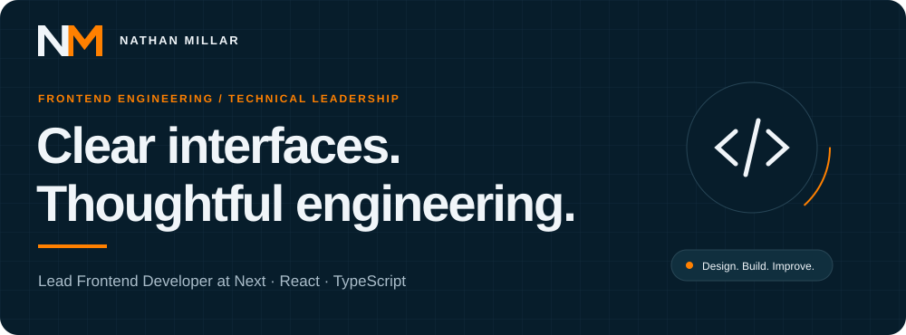
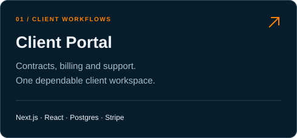
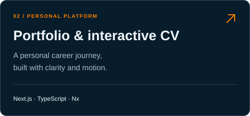
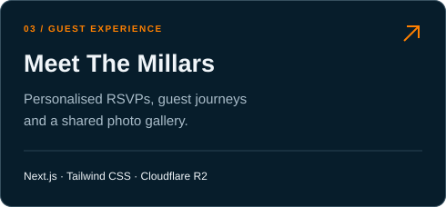
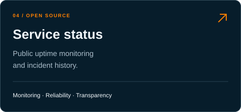

  

  
  
  
  

## Hello, I’m Nathan.

I’m a **Lead Frontend Developer at Next**, combining hands-on React and TypeScript development with technical planning, application architecture and mentoring.

I work on ecommerce experiences across UK and international sites: modernising shopping journeys, building reusable UI foundations and improving how teams deliver changes. Outside my full-time role, I build independent web projects from requirements through to ongoing support.

## Selected work

<table>
<tr>
<td width="50%"></td>
<td width="50%"></td>
</tr>
<tr>
<td width="50%"></td>
<td width="50%"></td>
</tr>
</table>

Most of my commercial and client work lives in private repositories. These links showcase the public experiences and project overviews; [my CV](https://www.nathanmillar.co.uk/cv?utm_source=github&utm_medium=referral&utm_campaign=profile) covers the wider picture.

## Tools I work with

  &nbsp;&nbsp;
  &nbsp;&nbsp;
  &nbsp;&nbsp;
  &nbsp;&nbsp;
  &nbsp;&nbsp;
  &nbsp;&nbsp;
  &nbsp;&nbsp;
  &nbsp;&nbsp;

| Area | Experience |
| :--- | :--- |
| Frontend | React, TypeScript, JavaScript, Next.js, Tailwind CSS, Material UI, Storybook |
| State & data | Redux Toolkit, React Context, React Query |
| Quality | Jest, Vitest, React Testing Library, Playwright, Cypress, Percy, axe-core |
| Architecture & delivery | Module Federation, microservices, shared UI, GitHub Actions, Azure DevOps, Docker Compose |
| AI-assisted development | GitHub Copilot, Codex, GPT, Gemini, NotebookLM |

## How I work

- **Build reusable foundations.** Shared components and clear boundaries make the next change easier.
- **Keep quality close to delivery.** Testing, accessibility and performance belong in everyday engineering.
- **Stay hands-on and support the team.** Technical decisions, code reviews and mentoring work best alongside implementation.

---

**Have something worth building?** [Say hello](mailto:hello@nathanmillar.co.uk) · [Explore my experience](https://www.nathanmillar.co.uk/cv?utm_source=github&utm_medium=referral&utm_campaign=profile) · [Service status](https://status.nathanmillar.co.uk)
